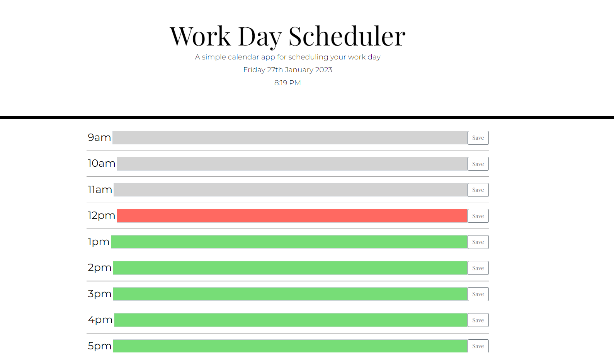

# Third-Party APIs: Work Day Scheduler

## Your Task

I have created an hour blocking daily planner application that allows user to save tasks for each hour. The  application is color coded depending on the time of day. The application will highlight the current hour in red, previous hours in grey, and future hours in green.

I used Moment.js to generate the and date, Bootstrap for the UI and used jQuery within JavaScript.

## Screenshot

  

## Link to Deployed Site

https://jaycee808.github.io/daily-planner/
